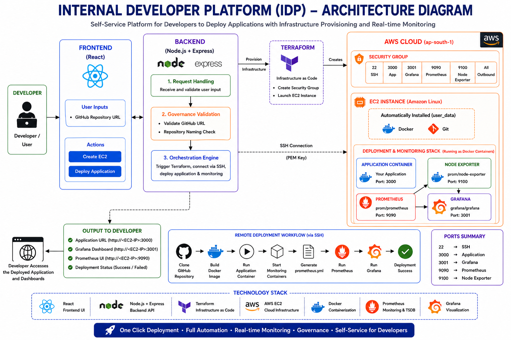

# 🚀 Mini Internal Developer Platform (Mini-IDP)

## 📌 Project Overview

This project is a simplified Internal Developer Platform (IDP) built using Terraform, Docker, Node.js, Prometheus, and Grafana.

The platform enables developers to:
- Provision infrastructure automatically
- Deploy applications using GitHub repositories
- Follow standardized deployment workflows (Golden Paths)
- Monitor deployed applications using Prometheus and Grafana
- Enforce governance and deployment policies

This project demonstrates core Platform Engineering concepts including self-service infrastructure, automation, observability, and governance.

---

# 🏗️ Architecture



---

# ⚙️ Features

## ✅ Self-Service Infrastructure Provisioning
- Automated EC2 provisioning using Terraform
- Infrastructure created directly from frontend UI

## ✅ Automated Application Deployment
- GitHub repository-based deployments
- Dockerized application deployment
- SSH-based deployment automation

## ✅ Golden Path Deployment Workflow
Standardized deployment pipeline:
1. Clone repository
2. Build Docker image
3. Run application container
4. Configure monitoring automatically

## ✅ Observability & Monitoring
- Node Exporter for EC2 metrics
- Prometheus for metrics collection
- Grafana dashboards for visualization

## ✅ Governance Automation
- Only GitHub repositories allowed
- Dockerfile validation
- Naming convention enforcement
- Terraform tagging policies
- Deployment audit logging

---

# 🛠️ Tech Stack

| Layer | Technologies |
|---|---|
| Frontend | React.js |
| Backend | Node.js, Express.js |
| Infrastructure | Terraform |
| Cloud | AWS EC2 |
| Containerization | Docker |
| Monitoring | Prometheus, Grafana |
| Metrics Exporter | Node Exporter |

---

# 📂 Project Structure

```text
MINI-IDP/
│
├── .github/
│   └── workflows/
│       └── deploy.yml
│
├── governance/
│   ├── validateDockerfile.js
│   ├── validateNaming.js
│   ├── validatePorts.js
│   └── validateRepo.js
│
├── idp-backend/
│   ├── logs/
│   ├── node_modules/
│   ├── index.js
│   ├── package.json
│   └── package-lock.json
│
├── idp-ui/
│   ├── public/
│   ├── src/
│   ├── .env
│   ├── package.json
│   ├── package-lock.json
│   └── README.md
│
├── infra/
│   ├── terraform/
│   ├── ec2/
│       ├── main.tf
│       ├── outputs.tf
│       └── pemfile.pem
│── templates/
│
├── .gitignore
├── ARCHITECTURE.md
├── GOVERNANCE.md
├── MONITORING.md
├── ONBOARDING.md
├── image.png
├── image-1.png
└── README.md

---

# 🚀 Deployment Workflow

## Step 1 — Provision EC2
The frontend triggers Terraform automation through backend APIs.

## Step 2 — Deploy Application
The backend:
- Clones GitHub repository
- Builds Docker image
- Runs Docker container

## Step 3 — Monitoring Setup
The platform automatically:
- Starts Node Exporter
- Configures Prometheus
- Starts Grafana

---

# 📊 Monitoring URLs

| Service | Port |
|---|---|
| Application | 3000 |
| Grafana | 3001 |
| Prometheus | 9090 |
| Node Exporter | 9100 |

---

# 🔐 Governance Policies

The platform enforces:
- Approved GitHub repositories only
- Mandatory Dockerfile validation
- Naming standards
- Infrastructure tagging policies
- Deployment audit logging

Refer to:
```bash
GOVERNANCE.md
```

---

# 📈 Observability Stack

| Tool | Purpose |
|---|---|
| Node Exporter | EC2 Metrics |
| Prometheus | Metrics Collection |
| Grafana | Dashboard Visualization |

---

# 🧪 Sample Metrics Visualized

- CPU Usage
- Memory Usage
- Disk Usage
- Network Metrics
- EC2 Health Metrics

---

# 🚀 Future Enhancements

- Kubernetes deployment support
- CI/CD pipeline integration
- Role-based access control
- Auto-scaling
- HTTPS & domain support
- Alertmanager integration

---

